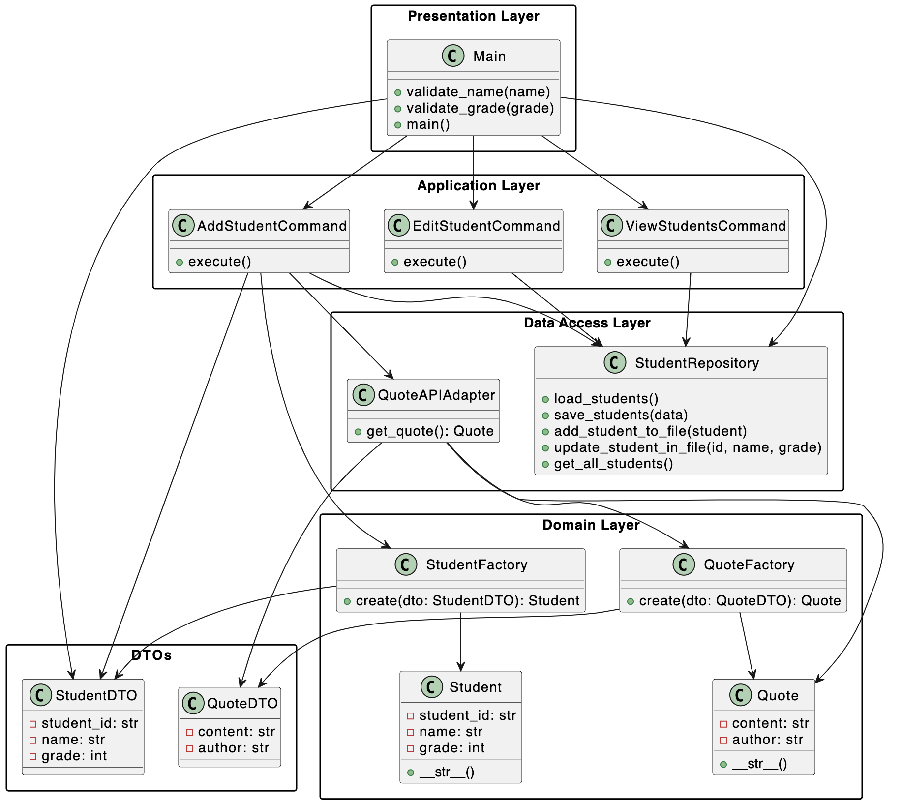

# Console-based-Student-Record-Management-System
Console-based Student Record Management System by Darya Stasiuk from group 353505
# UI description
```
-----------------------------------------------STUDENT MANAGEMENT SYSTEM-----------------------------------------------
1. Add Student
2. Edit Student
3. View Students
4. Exit
Choose option:
```
#  Functions
## Add Student
```
-----------------------------------------------STUDENT MANAGEMENT SYSTEM-----------------------------------------------
1. Add Student
2. Edit Student
3. View Students
4. Exit
Choose option: 1
Enter Name: Sasha Stasiuk
Enter Grade: 80
Student Added Successfully: ID: 8, Name: Sasha Stasiuk, Grade: 80
Motivational Quote: 
"By accepting yourself and being fully what you are, your presence can make others happy." — Jane Roberts
```
## Edit Student
```
-----------------------------------------------STUDENT MANAGEMENT SYSTEM-----------------------------------------------
1. Add Student
2. Edit Student
3. View Students
4. Exit
Choose option: 3
All Students:
ID: 1, Name: Dasha, Grade: 100
ID: 2, Name: Liza, Grade: 22
ID: 3, Name: Kolya, Grade: 55
ID: 4, Name: Nastya, Grade: 23
ID: 5, Name: Luca, Grade: 2
ID: 6, Name: Polina, Grade: 77
ID: 7, Name: Darya Stasiuk, Grade: 90
ID: 8, Name: Sasha Stasiuk, Grade: 80

-----------------------------------------------STUDENT MANAGEMENT SYSTEM-----------------------------------------------
1. Add Student
2. Edit Student
3. View Students
4. Exit
Choose option: 2
Enter ID to edit: 9
No student found with ID 9.

-----------------------------------------------STUDENT MANAGEMENT SYSTEM-----------------------------------------------
1. Add Student
2. Edit Student
3. View Students
4. Exit
Choose option: 2
Enter ID to edit: 5
New Name: Misha h
New Grade: 45
Student Updated Successfully!
```
## View Students
```
-----------------------------------------------STUDENT MANAGEMENT SYSTEM-----------------------------------------------
1. Add Student
2. Edit Student
3. View Students
4. Exit
Choose option: 3
All Students:
ID: 1, Name: Dasha, Grade: 100
ID: 2, Name: Liza, Grade: 22
ID: 3, Name: Kolya, Grade: 55
ID: 4, Name: Nastya, Grade: 23
ID: 5, Name: Luca, Grade: 2
ID: 6, Name: Polina, Grade: 77
ID: 7, Name: Darya Stasiuk, Grade: 90
ID: 8, Name: Sasha Stasiuk, Grade: 80
```
# UML Diagramm
